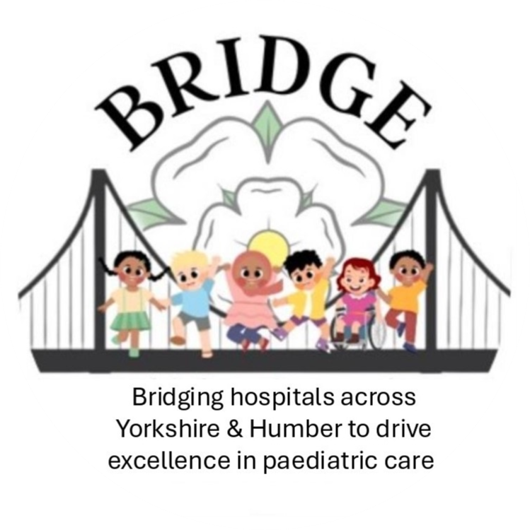

::: image-container

:::

<h5 style="text-align: center;">

We are a new resident doctor-led paediatric audit/QI/research network, situated in the Yorkshire and Humber Deanery. We aim to carry out high quality multi centre audit/QI/research projects and aim to widen access to research opportunities to trainees and locally employed doctors. 

We are currently looking for volunteers from all sites across the deanery, to participate in this endeavour. 

If this sounds like something for you, please sign up here:

[Click here for the Google form 👉](https://docs.google.com/forms/d/e/1FAIpQLSeak6pIi-BuTr9B10P1BEED9b-T4Vd3og4c3YVF3Uzyk2xIRA/viewform?usp=dialog)

✨ Why join?
Gain experience, build leadership skills, and help improve care for children—all in a friendly, supportive environment.

🙌 No experience needed—just enthusiasm and a willingness to get involved!

[Read our contitution here](downloads/ConstitutionBRIDGE2026.docx)

[Read our standard operating procedure for authorship here](downloads/SOPBRIDGE.docx)

</h5>

<h2 style="text-align: center;">

</h2>

<h5 style="text-align: center;">

[Check out the previous research training for clinician videos collated on the Previous Research Training Videos Tab](https://bridgepaediatrics.github.io/quarto/previous_videos.html)

Get in touch via e-mail with:

</h5>

<h5 style="text-align: center;">

[bridge.paedsresearch.yh\@gmail.com](mailto:bridge.paedsresearch.yh@gmail.com)

</h5>

<h2 style="text-align: center;">

</h2>

<h5 style="text-align: center;">

Join the conversation with us on X via the handle:

[BridgePaedsR_yh](https://twitter.com/BridgePaedsR_yh)

</h5>

 

 
